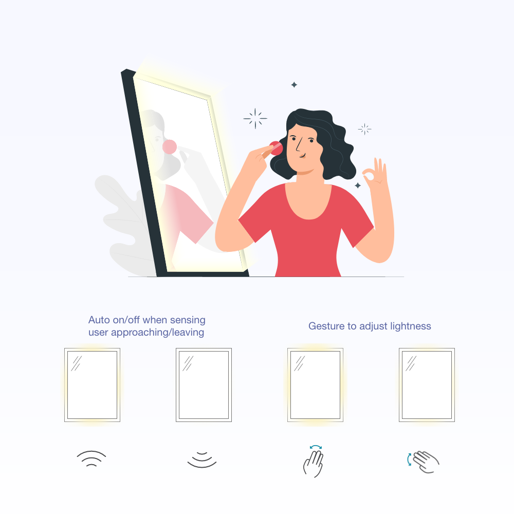

# Self-control-Lightening-Make-up-Mirror-Arduino
A smart lighting mirror

Free your hands when doing skincare & makeup from light control. This mirror has a distance sensor and a gesture sensor. It will automatically light up when user is approaching and user can control lightness with very easy hand gestures without touching it, keeping hands clean and free.

Technical:
- C++: Programming sensing distance and gesture type to control the color and lightness of LED stripe
- Arduino Board
- Adafruit APDS9960 Gesture Sensor
- Ultrasonic Sensor HC-SR04

